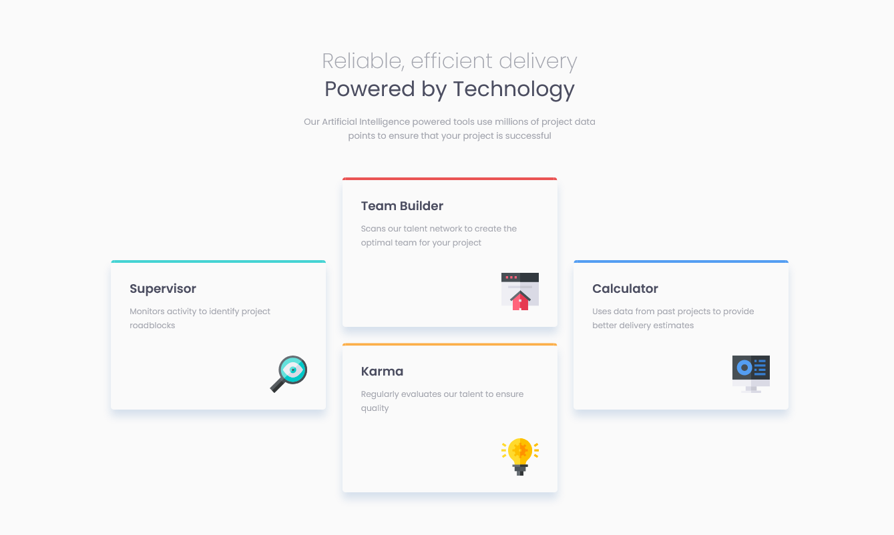

# Four card feature section

Solução do [desafio](https://www.frontendmentor.io/challenges/four-card-feature-section-weK1eFYK) proposto pela plataforma Frontend Mentor.

---

## Sumário

- [Visão geral](#visão-geral)
  - [O desafio](#o-desafio)
  - [Demonstração](#demonstração)
- [Desenvolvimento](#desenvolvimento)
  - [Construído com](#contruído-com)
- [Autor](#autor)

---

## Visão Geral

### O Desafio

Os usuários da aplicação devem ser capazes de:

- Visualizar o layout ideal para o site, dependendo do tamanho da tela do dispositivo.

### Demonstração

---

## Desenvolvimento

### Construído com

- [HTML5](https://devdocs.io/html/);
  - Semântica;
  - Estruturação; e
  - Utilização das melhores práticas para acessibilidade e, em certo nível, SEO.
- [Sass](https://sass-lang.com/);
  - Flexbox, animações e efeitos de estado (hover) com transform;
  - Criação e importação de partials com @use;
  - Reutilização de estilos com Mixins; e
  - Uso do módulo interno "color" para ajuste das cores da aplicação, quando necessário.
- [TypeScript](https://www.typescriptlang.org/);
  - Variáveis, parâmetros e retornos de função 100% tipados.
- [ReactJS](https://reactjs.org/);
  - Utilização de Componentes; e
  - Atribuição de valores dinâmicos, através das Propriedades, aos Componentes.
- [Husky](https://typicode.github.io/husky/#/);
  - Interceptação de ações executadas pelo Git com os Git Hooks.
- [Commitizen](https://github.com/commitizen/cz-cli); e
  - Criação de mensagens de commit baseadas no [Conventional Changelog](https://github.com/conventional-changelog/conventional-changelog).
- [Commitlint](https://commitlint.js.org/#/).
  - Validação, anteriormente ao salvamento, das mensagens de commit.

---

## Autor

  

  

    <h3>
      🤝🏽 Thiago Raniery Brito
    </h3>
    

      E aí, Dev, gostou da solução? Bom, se quiser, fique à vontade para contribuir com sugestões, ou apenas entrar em contato comigo, por meio de qualquer uma das plataformas abaixo, até mais! 👋🏽
    

  

  
  

    
    
    
    
    
  

---
